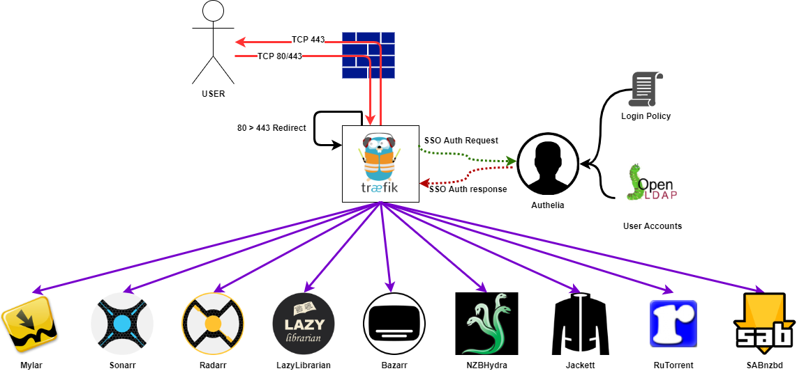

# dockerhomelab
Self container docker homelab accessible via https. Certificates generated by letsencrypt. All sites are accessible via SSO or basic authentication (where required by NZB360). It's recommended you run this on 1 VM such as Alpine OS.

Contains

| Application   | URLs                                                           | Purpose                                 |
|---------------|----------------------------------------------------------------|-----------------------------------------|
| Portainer     | https://DOMAIN/portainer                                       | Manage containers                       |
| Watchtower    | N/A                                                            | Update containers to new versions       |
| ddclient      | N/A                                                            | update DNS A records with IP changes    |
| OpenLDAP      | N/A                                                            | single repository of user accounts      |
| Traefik       | N/A                                                            | Reverse Proxy                           |
| Authelia      | https://AUTH_SUBDOMAIN.DOMAIN                                  | Single Signon frontend                  |
| PHPLDAPADMIN  | https://DOMAIN/phpldapadmin                                    | web interface for openldap              |
| Radarr        | https://DOMAIN/radarr && https://BASIC_SUBDOMAIN.DOMAIN/radarr | Movie downloader                        |
| Sonarr        | https://DOMAIN/sonarr && https://BASIC_SUBDOMAIN.DOMAIN/sonarr | TV show downloader                      |
| Bazarr        | https://DOMAIN/subtitles                                       | Subtitle downloader                     |
| Lazylibrarian | https://DOMAIN/books                                           | Book downloader                         |
| Mylar         | https://DOMAIN/comics                                          | comic downloader                        |
| NZBHydra      | https://DOMAIN/hydra2 && https://BASIC_DOMAIN.DOMAIN/hydra2    | search multiple usenet indexers at once |
| Jackett       | https://DOMAIN/jackett && https://BASIC_SUBDOMAIN.DOMAIN/jackett | search multiple torrent sites at once |
| Calibre-Web   | https://calibre.DOMAIN                                         | Organize ebook libraries                |
| SABnzbd       | https://DOMAIN/sabnzbd && https://BASIC_SUBDOMAIN.DOMAIN/sabnzbd | download from usenet                  |
| Transmission  | https://DOMAIN/transmission && https://BASIC_SUBDOMAIN.DOMAIN/transmission | download torrents           |       



### Usage
#### Step 1 - Download files from git

#### Step 2 - Perms, Modify values for docker, openldap and authelia
1. Setup folder perms used for volumes (if used for linux, for windows set PIDs as 1000 because you can't use multiple accounts)  
   - Create user account                                                                       
   - Create folders and grant user access. Although docker will create them you need to apply perms to grant access.
   - Get UID (PUID) and GID (PGID) of user. cmd: *id username*. Needed for .env file

2. Docker \
Duplicate .env_template as .env
Update values as appropriate \
For an example where i have the website name of example.com
  ```
  CONFIG=/mnt/config       
  CONTENT=/mnt/data          
  LDAP_PID=1001
  AUTHELIA_PID=1600
  TRAEFIK_PID=1500
  OTHER_PID=1800
  MEDIA_PID=1000                    
  DOMAIN=example.com            
  EMAIL=admin@example.com       
  SSOAUTH_SUBDOMAIN=auth        
  BASICAUTH_USER=basicuser      
  BASICAUTH_PASSWORD="encrypted password generated from https://www.htaccesstools.com/htpasswd-generator/"
  BASICAUTH_SUBDOMAIN=basic
  NORDVPN_USERNAME= bob@bob.com
  NORDVPN_PASSWORD= PASSWORD
  COMICVINE_API=create an account from https://comicvine.gamespot.com/api/. Needed for mylar
  ```

3. OpenLDAP
   - run PowerShell command with switches `updatebasevalues.ps1 -LDAPUpdate -DomainName your_domain.com` to create */ldap/00-startup.ldif* with correct domainname values

4. Authelia
   - run PowerShell command with switches `updatebasevalues.ps1 -AutheliaUpdate -DomainName your_domain.com -AutheliaEmail youremail@gmail.com` to create */authelia/configuration.yml* with correct values

5. Secrets
   - populate the following secrets files *authelia-jwt*, *authelia-session*, *authelia-smtp*, *ldap-admin*, *ldap-config*, *ldap-ro*, *portainer-admin* in */secrets/* 

#### Step 3 - Run
run `docker-compose up -d ` \
This will download all containers & create other folders where needed

#### Step 4 - Modify values
Some default values will need to be changed for your site to work.
1. (if running windows) Start by running `updatebasevalues.ps1 -ConfigFolder configfoldertoppath -ConfigUpdates -DomainName your_domain.com` . This will change the domain url for many sites and grant access to sabnzbd. Otherwise good luck editing!
2. create users and admins group and user accounts in openldap (if not already) - if stuck for setting passwords connect to LDAPADMIN.exe tool using docker IP.
3. ddclient \
add values for your dynamic IP  \
for example if you were using namecheap and updating records for example.com,auth.example.com and basic.example.com it would be

  ```
  use=web
  web=dynamicdns.park-your-domain.com/getip
  protocol=namecheap,				\
  server=dynamicdns.park-your-domain.com,	\
  login=example.com,			\
  password=PASSWORD 
  @,auth,basic
  ```

#### Step 5 - Re-run as production
Once you have completed all steps and are satisified it will work hash out line in *docker-compose.yml* \
  *--certificatesResolvers.letsencrypt.acme.caServer=https://acme-staging-v02.api.letsencrypt.org/directory* \
  Next re-run `docker-compose up -d` &  will now get a legit letsencrypt certificate
